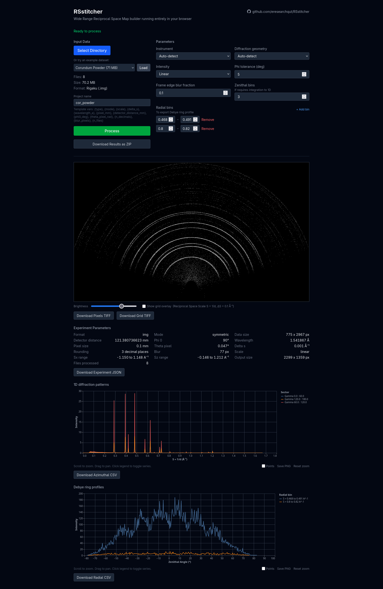
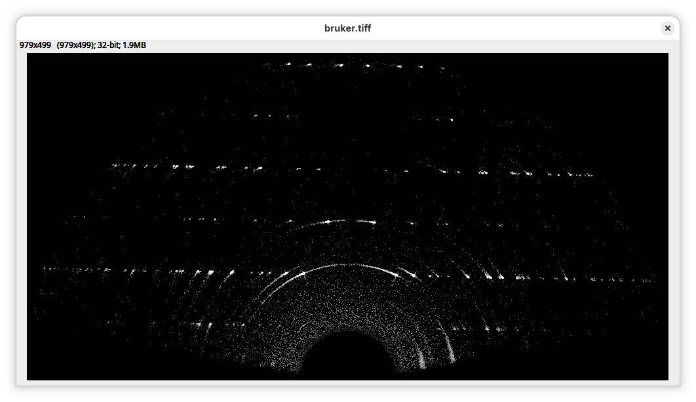

# RSstitcher

RSstitcher is a Python library and command-line interface program for seamless merging of 2D diffraction frames for Wide
Range
Reciprocal Space Mapping.

## Quick Start

**Try it in your browser first — no installation needed:**

The easiest way to use RSstitcher is the [web version](https://eresearchqut.github.io/RSstitcher/). It runs entirely in your browser using WebAssembly. Data stays on your machine and is never uploaded to any server.



**To install and run locally:**

1. Download and extract the repository ZIP file by clicking the "Download repository" button in the top right of this
   page.
2. In a terminal emulator, navigate to the extracted directory.
3. With Python 3.13+, install RSstitcher:
    1. If using regular Python, run the following command:
        1. `python -m pip install .`
       2. **NOTE**: If you get an error, try following these instructions to create and use a new virtual environment first: [https://realpython.com/python-virtual-environments-a-primer/#how-can-you-work-with-a-python-virtual-environment](https://realpython.com/python-virtual-environments-a-primer/#how-can-you-work-with-a-python-virtual-environment)
    2. If using conda, run the following commands to install RSstitcher in a new environment:
        1. `conda create --name rsstitcher python=3.13`
        2. `conda activate rsstitcher`
        3. `python -m pip install .`
4. Run on test data: `rsstitcher tests/data/bruker_symmetric --write pixels_tiff=output.tiff`
    1. **NOTE**: If you get an error, try running `python rsstitcher/main.py ...` instead of `rsstitcher ...`
5. In the same directory, view the created file `output.tiff` in an image viewer (e.g. ImageJ)
    1. Feel free to adjust the contrast and brightness
    2. 
6. Continue to test the other examples in the [`tests/data`](tests/data) directory.

Expected runtime: several seconds. Creates a 979 x 499 pixel reciprocal space map.

See the instructions below for more details.

## System requirements

- Requires [Python 3.13+](https://www.python.org/downloads/release/python-3139/)
- Runs on Linux, macOS, and Windows.
- Typically uses up to 1GB of RAM, but may require more depending on the size of the experiment data.

## Supported data formats

These are the only file formats with built-in support. See the [custom instruments guide](rsstitcher/instruments/README.md) for instructions on using a custom data format.

- Bruker `.gfrm` files
- Rigaku `.img` files

## Command-line interface usage

To use RSstitcher, you must provide a path to a directory containing 2D diffraction images, where the first file in the
sorted list is the first image in the experiment. For example:

```
WRRSM_3-40_chi0-80-10_alpha0.4_0001.img
WRRSM_3-40_chi0-80-10_alpha0.4_0002.img
WRRSM_3-40_chi0-80-10_alpha0.4_0003.img
WRRSM_3-40_chi0-80-10_alpha0.4_0004.img
WRRSM_3-40_chi0-80-10_alpha0.4_0005.img
WRRSM_3-40_chi0-80-10_alpha0.4_0006.img
WRRSM_3-40_chi0-80-10_alpha0.4_0007.img
WRRSM_3-40_chi0-80-10_alpha0.4_0008.img
WRRSM_3-40_chi0-80-10_alpha0.4_0009.img
```

There is example data included in the repository, which can be used to test the software. It can be found in the
following directories:

| Dataset name     | Data type         | Path                                                         |
|------------------|-------------------|--------------------------------------------------------------|
| bruker_gid       | Bruker gfrm files | [`tests/data/bruker_gid`](tests/data/bruker_gid)             |
| bruker_symmetric | Bruker gfrm files | [`tests/data/bruker_symmetric`](tests/data/bruker_symmetric) |
| rigaku_gid       | Rigaku img files  | [`tests/data/rigaku_gid`](tests/data/rigaku_gid)             |
| rigaku_symmetric | Rigaku img files  | [`tests/data/rigaku_symmetric`](tests/data/rigaku_symmetric) |
| new_data         | Rigaku img files  | [`tests/data/new_data`](tests/data/new_data)                 |
| cor_powder       | Rigaku img files  | [`tests/data/cor_powder`](tests/data/cor_powder)              |

To run RSstitcher, and only output the results to the console. For example, with the bruker sample data:

Command:

```
rsstitcher tests/data/bruker_symmetric
```

Result:

```
Experiment parameters:
----------------------
Type                           gfrm
Data size                      192 x 1101 pixels
Detector distance              280.0 mm
Phi 0                          0.0 degrees
Wavelength                     1.78897 Å
Pixel size                     0.075 mm
Theta pixel                    0.100 degrees
Phi tolerance                  5.0 degrees
Blur                           19 pixels
Delta s                        0.002 Å⁻¹
Rounding                       3 decimal places
Scaling                        linear

Results:
--------
Sx range                       -0.980 to 0.978 Å⁻¹
Sz range                       -0.004 to 0.992 Å⁻¹
Number of pixels               980 x 499 pixels
Number of images processed     162 images
Time taken                     1.44 seconds
```

To write the combined 2D reciprocal space map to a file, use the `--write` option. For example, creating a file called
`bruker.tiff` in the current directory:

Command:

```
rsstitcher tests/data/bruker_symmetric --write pixels_tiff=bruker.tiff
```

Result:

```
Experiment parameters:
----------------------
Type                           gfrm
Data size                      192 x 1101 pixels
Detector distance              280.0 mm
Phi 0                          90.0 degrees
Wavelength                     1.78897 Å
Pixel size                     0.075 mm
Theta pixel                    0.100 degrees
Phi tolerance                  5.0 degrees
Blur                           19 pixels
Delta s                        0.002 Å⁻¹
Rounding                       3 decimal places
Scaling                        linear

Results:
--------
Sx range                       -0.962 to 0.972 Å⁻¹
Sz range                       -0.004 to 0.990 Å⁻¹
Number of pixels               968 x 498 pixels
Number of images processed     100 images
Time taken                     0.42 seconds

Files written:
--------------
pixels_tiff                    /tmp/bruker.tiff
```

To also write the grid overlay to a file, use the `--write` option again:

Command:

```
rsstitcher tests/data/bruker_symmetric --write pixels_tiff=bruker.tiff --write grid_tiff=bruker_overlay.tiff
```

Result:

```
Experiment parameters:
----------------------
Type                           gfrm
Data size                      192 x 1101 pixels
Detector distance              280.0 mm
Phi 0                          90.0 degrees
Wavelength                     1.78897 Å
Pixel size                     0.075 mm
Theta pixel                    0.100 degrees
Phi tolerance                  5.0 degrees
Blur                           19 pixels
Delta s                        0.002 Å⁻¹
Rounding                       3 decimal places
Scaling                        linear

Results:
--------
Sx range                       -0.962 to 0.972 Å⁻¹
Sz range                       -0.004 to 0.990 Å⁻¹
Number of pixels               968 x 498 pixels
Number of images processed     100 images
Time taken                     0.46 seconds

Files written:
--------------
pixels_tiff                    /tmp/bruker.tiff
grid_tiff                      /tmp/bruker_overlay.tiff
```

There are two files created:

```
bruker.tiff  bruker_overlay.tiff
```

You may then view the combined 2D reciprocal space map in any image viewer (eg. ImageJ, FIJI, etc.).

To see the full list of command line options, run the following command:

Command:

```
rsstitcher --help
```

Result:

```
usage: rsstitcher [-h] [-q] [--log-level {DEBUG,INFO,WARNING,ERROR,CRITICAL}]
                  [--write OUTPUT=PATH] [--circles [CIRCLES ...]]
                  [--mode {auto,symmetric,gid}] [--scale {linear,log,sqrt}]
                  [--phi-tolerance PHI_TOLERANCE]
                  [--blur-fraction BLUR_FRACTION] [--azimuthal-bins N]
                  [--radial-bins MIN,MAX [MIN,MAX ...]] [--instrument NAME |
                  --instrument-path PATH]
                  path

Process 2D diffraction images into a 2D reciprocal space map.

positional arguments:
  path                  Path to the directory containing the experiment data.

options:
  -h, --help            show this help message and exit
  -q, --quiet           Suppress all output except errors
  --log-level {DEBUG,INFO,WARNING,ERROR,CRITICAL}
                        Set the logging level
  --write OUTPUT=PATH   Write output to a custom path or template

                        Format: OUTPUT=PATH
                        Outputs: pixels_tiff, grid_tiff, experiment_json, azimuthal_csv, radial_csv, radial_overlay_tiff.

                        Example: --write pixels_tiff=project_{delta_s}_S.tiff --write grid_tiff=overlays.tiff

                        Template variables:
                            - type
                            - data_size
                            - detector_distance_mm
                            - phi0_deg
                            - wavelength_a
                            - pixel_mm
                            - theta_pixel_rad
                            - delta_s
                            - n_decimals
                            - blur_pixels
                            - scale

  --circles [CIRCLES ...]
                        Overlay radial circles in Å⁻¹ on the output grid.
                        Provide a list of radii (e.g., --circles 0.5 1.0 1.5), or pass -1 to draw
                        default circles every 0.1 Å⁻¹ up to the max radius (e.g., --circles -1).
                        If provided with no values (just --circles), defaults to -1.
  --mode {auto,symmetric,gid}
                        Coordinate transform mode. 'auto' detects from omega range. Default: auto
  --scale {linear,log,sqrt}
                        Intensity scaling mode to apply after baseline subtraction and before blur. Default: linear
  --phi-tolerance PHI_TOLERANCE
                        Allowed tolerance for phi angle mirroring, in degrees. Default: 5.0 degrees
  --blur-fraction BLUR_FRACTION
                        Fraction of pixels to blur after scaling. Use 0 to disable blurring. Default: 0.1
  --azimuthal-bins N    Number of azimuthal sectors for averaging. Enables azimuthal_csv output.
  --radial-bins MIN,MAX [MIN,MAX ...]
                        Radial bins as MIN,MAX pairs (e.g., --radial-bins 0.5,1.0 1.0,2.0). Enables radial_csv output.
  --instrument NAME     Use a specific built-in instrument instead of auto-detecting.
                        Accepts a name or file extension (e.g. 'gfrm', 'Bruker GFRM', 'img', 'Rigaku IMG').
  --instrument-path PATH
                        Path to a custom instrument config JSON file.

```

You can combine options to create more complex outputs. For example:

Command:

```
rsstitcher tests/data/rigaku_gid --circles 0.1 0.2 0.3 0.4 0.5 --scale sqrt --phi-tolerance 10 --blur-fraction 0.2 --write pixels_tiff=gid_output.tiff --write grid_tiff=gid_overlay.tiff
```

Result:

```
Experiment parameters:
----------------------
Type                           img
Data size                      775 x 846 pixels
Detector distance              121.028451438 mm
Phi 0                          0.185 degrees
Wavelength                     1.541867 Å
Pixel size                     0.1 mm
Theta pixel                    0.047 degrees
Phi tolerance                  10.0 degrees
Blur                           155 pixels
Delta s                        0.001 Å⁻¹
Rounding                       3 decimal places
Scaling                        sqrt

Results:
--------
Sx range                       -0.466 to 0.467 Å⁻¹
Sz range                       -0.478 to 0.181 Å⁻¹
Number of pixels               934 x 660 pixels
Number of images processed     4 images
Time taken                     1.78 seconds

Files written:
--------------
pixels_tiff                    /tmp/gid_output.tiff
grid_tiff                      /tmp/gid_overlay.tiff
```

The output files are:

```
gid_output.tiff  gid_overlay.tiff
```

## Python Usage

You may also use RSstitcher from within Python scripts or Jupyter notebooks.

### Basic Example

```python
from rsstitcher import run_experiment

results = run_experiment('/path/to/experiment_data')
# {
#         "result_array": ...,
#         "out_sx_inv_angstroms": ...,
#         "out_sz_inv_angstroms": ...,
#         "experiment": ...,
# }
reciprocal_map = results["result_array"]
print(f"Map created with shape: {reciprocal_map.shape}")
```

## Tests

To run the tests, install the development dependencies:

```
pip install pytest
```

Then run pytest from the root directory:

```
$ pytest
============================= test session starts ==============================
platform linux -- Python 3.13.7, pytest-8.4.2, pluggy-1.6.0
rootdir: /tmp/RSstitcher
configfile: pyproject.toml
collected 3 items

tests/test_cli.py ...                                                    [100%]

============================== 3 passed in 9.96s ===============================
```

## Disclaimer

The web version of RSstitcher was developed with support from an AI model (Claude Opus 4.6 by Anthropic).
